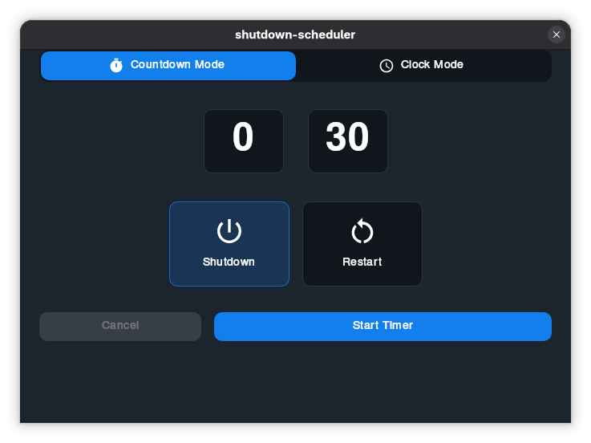

# Shutdown Scheduler (Beta)

  

Shutdown Scheduler is a GUI application that lets users control when they want their PCs to shutdown and reboot. Under the hood it's a `shutdown` frontend (Linux only by now).

## Features

- [x] Schedule shutdown
- [x] Schedule reboot
- [ ] Schedule sleep (maybe?)

## OS support

- [x] Linux
  - [x] Fedora
  - [x] Ubuntu/Debian (untested, but deb package available)
  - [x] Others (untested, but appimage available)
- [ ] Windows (maybe in the future)
- [ ] macOS (not planned, I almost never turn my macbook off)

## License

This project is licensed under the GPLv3. See the [LICENSE](LICENSE) file for more information.

## Credits

Made with ♥️ by [DeimosHall](deimoshall.dev)
